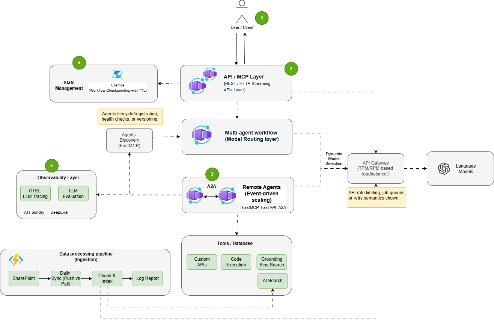

> 🚀 *Building one AI agent is straightforward. Orchestrating multiple that collaborate, remember context, and scale globally? That's MAESTRO.*


# 🎭 MAESTRO: Multi-Agent Enterprise Solution for Tasks, Realtime & Orchestration

A production-ready multi-agent solution accelerator for building scalable, observable, and reliable multi-agent AI systems using LangGraph, FastMCP (Model Context Protocol), and Azure services.

---

## 📑 Table of Contents

1. [🎯 Introduction](#1-introduction)
2. [💡 Purpose & Objectives](#2-purpose--objectives)
3. [✅ Prerequisites](#3-prerequisites)
4. [🚀 How to Run](#4-how-to-run)
5. [🏗️ Design](#5-design)
6. [📊 Data Pipeline](#6-data-pipeline)
7. [☁️ Local vs Azure Deployment](#7-local-vs-azure-deployment)
8. [🗑️ How to Undeploy/Delete](#8-how-to-undeploydelete)
9. [⚠️ Limitations](#9-limitations)
10. [📝 Summary](#10-summary)

---

## 1️⃣ Introduction

This repository provides a **solution accelerator** for building enterprise-grade multi-agent AI systems. It demonstrates best practices for orchestrating multiple specialized AI agents that collaborate to complete complex tasks—in this case, generating high-quality social media content.

The system implements:
- 🤝 **A2A (Agent-to-Agent) Protocol** for standardized inter-agent communication
- 🔌 **FastMCP (Model Context Protocol)** for exposing AI capabilities as tools
- 📊 **LangGraph** for workflow orchestration and state management
- 🧠 **LLM-Driven Intelligent Routing** using Azure OpenAI reasoning models (o1/o3/o4-mini) for dynamic workflow decisions
- 📈 **OpenTelemetry** for distributed tracing and observability
- ☁️ **Azure Container Apps** for scalable microservices deployment

### 🛠️ Key Technologies

| Technology | Purpose |
|------------|---------|
| 🐍 Python 3.11+ | Primary language |
| 📊 LangGraph | Workflow orchestration |
| 🚀 FastAPI | REST API framework |
| 🔌 FastMCP | MCP protocol server |
| 🤖 Azure OpenAI | LLM inference |
| 🔍 Azure AI Search | Vector search & RAG |
| 📦 Azure Cosmos DB | State checkpointing |
| ☁️ Azure Container Apps | Serverless containers |
| 📡 OpenTelemetry | Distributed tracing |
| ✅ DeepEval | LLM output evaluation |

---

## 2️⃣ Purpose & Objectives

### 🎯 Purpose

This accelerator serves as a **template and reference implementation** for teams building production multi-agent AI systems. It demonstrates:

1. 🏢 **Microservices Architecture** - Each agent runs as an independent service
2. 🤝 **A2A Protocol Communication** - Standardized HTTP-based agent communication
3. 🔌 **MCP Integration** - Standards-compliant AI tool exposure
4. 📚 **RAG Pattern** - Retrieval-Augmented Generation using Azure AI Search
5. 📊 **Production Observability** - Full distributed tracing with OpenTelemetry
6. 💾 **State Management** - Persistent workflow state with Cosmos DB checkpointing
7. ✅ **LLM Evaluation** - Quality assessment using DeepEval metrics
8. 🧠 **LLM-Driven Routing** - Intelligent workflow transitions using Azure OpenAI reasoning models (o1/o3/o4-mini)

### ✅ Objectives

- ✅ Provide a working multi-agent system template
- ✅ Demonstrate agent collaboration patterns (Planner → Researcher → Writer → Reviewer)
- ✅ Show best practices for Azure AI service integration
- ✅ Enable both local development and cloud deployment
- ✅ Support independent agent scaling and fault isolation
- ✅ Include comprehensive observability and logging
- ✅ Implement intelligent routing with reasoning model transparency

### 💼 Use Case: Social Media Content Generation

The default implementation generates LinkedIn posts through coordinated agent collaboration:

```
User Request → Planner → Researcher → Writer → Reviewer → Final Post
```

This pattern can be adapted for other multi-agent scenarios (code generation, document summarization, data analysis, etc.).

---

## 3️⃣ Prerequisites

### 💻 Required Software

| Software | Version | Purpose |
|----------|---------|---------|
| 🐍 Python | 3.11+ | Runtime environment |
| 🐳 Docker Desktop | Latest | Local container orchestration |
| ☁️ Azure CLI | 2.50+ | Azure resource management |
| 🚀 Azure Developer CLI (azd) | Latest | Infrastructure deployment |
| 📦 Git | Latest | Source control |

### ☁️ Required Azure Services

| Service | Purpose |
|---------|---------|
| 🤖 Azure OpenAI | LLM inference (GPT-4o recommended) |
| 🔍 Azure AI Search | Vector search for RAG |
| 📦 Azure Cosmos DB | Workflow state persistence |
| 📄 Azure Document Intelligence | PDF parsing (for data pipeline) |
| ☁️ Azure Container Apps | Production deployment |
| 📋 Azure Container Registry | Container image storage |
| 📊 Azure Application Insights | Observability and monitoring |

### 🔐 Environment Variables

Create a `.env` file in the project root with the following variables:

```bash
# =============================================================================
# 🤖 Azure OpenAI Configuration
# =============================================================================
AZURE_OPENAI_ENDPOINT=https://your-openai-service.openai.azure.com/
AZURE_OPENAI_API_KEY=your-openai-api-key
AZURE_OPENAI_DEPLOYMENT_NAME=gpt-4o
AZURE_OPENAI_API_VERSION=2024-12-01-preview

# =============================================================================
# 🧠 Azure OpenAI Reasoning Model (for Intelligent Routing)
# =============================================================================
# Supports o1, o3, o4-mini for chain-of-thought workflow routing
AZURE_OPENAI_REASONING_DEPLOYMENT=o4-mini

# =============================================================================
# 📝 Azure OpenAI Embeddings (for Data Pipeline)
# =============================================================================
AZURE_OPENAI_EMBEDDINGS_ENDPOINT=https://your-openai-service.openai.azure.com/
AZURE_OPENAI_EMBEDDINGS_API_KEY=your-openai-api-key
AZURE_OPENAI_EMBEDDINGS_API_VERSION=2023-05-15
AZURE_OPENAI_EMBEDDINGS_DEPLOYMENT=text-embedding-3-small

# =============================================================================
# 🔍 Azure AI Search Configuration
# =============================================================================
AZURE_SEARCH_ENDPOINT=https://your-search-service.search.windows.net
AZURE_SEARCH_ADMIN_KEY=your-search-admin-key
AZURE_SEARCH_INDEX_NAME=documents-index

# =============================================================================
# 📦 Azure Cosmos DB Configuration
# =============================================================================
AZURE_COSMOSDB_ENDPOINT=https://your-cosmosdb-account.documents.azure.com:443/
AZURE_COSMOSDB_KEY=your-cosmosdb-key
AZURE_COSMOSDB_DATABASE_NAME=multi-agent-db
AZURE_COSMOSDB_CONTAINER_NAME=checkpoints

# =============================================================================
# 📄 Azure Document Intelligence (for Data Pipeline)
# =============================================================================
AZURE_DI_ENDPOINT=https://your-di-service.cognitiveservices.azure.com/
AZURE_DI_KEY=your-di-key

# =============================================================================
# 📊 Azure Application Insights
# =============================================================================
APPLICATIONINSIGHTS_CONNECTION_STRING=InstrumentationKey=...

# =============================================================================
# ⚙️ Application Configuration
# =============================================================================
ENVIRONMENT=development
LOG_LEVEL=INFO

# =============================================================================
# 📊 Data Pipeline Configuration (Optional)
# =============================================================================
CHUNK_SIZE=1000
CHUNK_OVERLAP=200
EMBEDDING_BATCH_SIZE=50
EMBEDDING_BATCH_DELAY=2.0
```

---

## 4️⃣ How to Run

### 🚀 Quick Start (Local with Docker)

```powershell
# 1️⃣ Clone the repository
git clone <repository-url>
cd multi-agent-ai-system-lang-accelerator

# 2️⃣ Copy environment template and configure
Copy-Item .env.param .env
# Edit .env with your Azure credentials

# 3️⃣ Start all services
docker-compose up --build

# 4️⃣ Verify services are running
curl http://localhost:8000/health
```

### 📍 Available Endpoints

| Endpoint | Description |
|----------|-------------|
| 📖 http://localhost:8000/docs | API Documentation (Swagger UI) |
| ❤️ http://localhost:8000/health | Orchestrator health check |
| 🔌 http://localhost:8000/mcp/tools | List available MCP tools |
| http://localhost:8001/health | Planner Agent health |
| 🎭 http://localhost:8001/.well-known/agent.json | Planner A2A Agent Card |
| http://localhost:8002/health | Researcher Agent health |
| 🎭 http://localhost:8002/.well-known/agent.json | Researcher A2A Agent Card |
| http://localhost:8003/health | Writer Agent health |
| 🎭 http://localhost:8003/.well-known/agent.json | Writer A2A Agent Card |
| http://localhost:8004/health | Reviewer Agent health |
| 🎭 http://localhost:8004/.well-known/agent.json | Reviewer A2A Agent Card |
| http://localhost:8005/health | Supervisor Agent health |
| 🎭 http://localhost:8005/.well-known/agent.json | Supervisor A2A Agent Card |
| 🔍 http://localhost:8005/agents | List discovered A2A agents |
| ✨ http://localhost:8005/generate | A2A-based post generation |

### 🔌 Using the MCP Client

```powershell
# Interactive mode
python clients/mcp_client.py
```

### 🛠️ Available MCP Tools

| Tool | Description |
|------|-------------|
| ⚡ `generate_linkedin_post_stream` | Generate a post using LangGraph workflow with streaming progress updates |
| 🔄 `generate_linkedin_post_sync` | Generate a post using Supervisor Agent (A2A) - no streaming, returns final result |
| 🔍 `discover_agents` | Discover all A2A agents and their capabilities |
| 🎫 `get_agent_card` | Get the Agent Card for a specific agent |
| 👋 `greet` | Simple test tool |

### 🐍 API Usage Example

```python
import httpx

# ⚡ Generate a LinkedIn post (streaming via LangGraph)
response = httpx.post(
    "http://localhost:8000/mcp/tools/call",
    json={
        "method": "tools/call",
        "params": {
            "name": "generate_linkedin_post_stream",
            "arguments": {
                "topic": "The future of AI in healthcare",
                "user_id": "user123"
            }
        }
    }
)

# 🔄 Generate a LinkedIn post (sync via Supervisor Agent)
response = httpx.post(
    "http://localhost:8000/mcp/tools/call",
    json={
        "method": "tools/call",
        "params": {
            "name": "generate_linkedin_post_sync",
            "arguments": {
                "topic": "The future of AI in healthcare",
                "user_id": "user123",
                "platform": "LinkedIn",
                "tone": "professional"
            }
        }
    }
)

# 🔍 Discover all A2A agents
response = httpx.post(
    "http://localhost:8000/mcp/tools/call",
    json={
        "method": "tools/call",
        "params": {
            "name": "discover_agents",
            "arguments": {}
        }
    }
)
print(response.json())  # Returns all discovered agents with skills
print(response.json())
```

### 🔍 Debugging with MCP Inspector

The [MCP Inspector](https://github.com/modelcontextprotocol/inspector) is an interactive developer tool for testing and debugging MCP servers. It provides a visual interface for exploring tools, resources, and prompts exposed by the orchestrator.

#### 📥 Installation

The Inspector runs directly through `npx` without requiring installation:

```powershell
npx @modelcontextprotocol/inspector
```

#### 🔗 Connecting to the Orchestrator for local development

1. **Start the services** (if not already running):
   ```powershell
   docker-compose up --build
   ```

2. **Launch MCP Inspector** pointing to your MCP endpoint:
   ```powershell
   # For SSE transport (default for this project)
   npx @modelcontextprotocol/inspector
   ```

3. **Configure the connection** in the Inspector UI:
   - **Transport Type**: SSE (Server-Sent Events)
   - **URL**: `http://localhost:8000/mcp/sse`

#### 🎨 Inspector Features

| Tab | Description |
|-----|-------------|
| **🛠️ Tools** | Lists available MCP tools (`generate_linkedin_post`, etc.), shows schemas, and allows testing with custom inputs |
| **📚 Resources** | Displays available resources and their metadata |
| **💬 Prompts** | Shows prompt templates and enables testing with custom arguments |
| **📢 Notifications** | Displays server logs and notifications in real-time |

#### 🔄 Development Workflow

1. **Start Development** - Launch Inspector and verify connectivity
2. **Iterative Testing** - Make server changes, rebuild (`docker-compose up --build`), reconnect Inspector
3. **Test Edge Cases** - Verify error handling with invalid inputs and missing arguments

#### 🐛 Troubleshooting

| Issue | Solution |
|-------|----------|
| 🚫 Connection refused | Ensure services are running: `docker ps` |
| ❓ Tools not appearing | Check orchestrator logs: `docker-compose logs orchestrator` |
| ⏱️ Timeout errors | Verify Azure OpenAI connectivity and API keys |

For more debugging strategies, see the [MCP Debugging Guide](https://modelcontextprotocol.io/legacy/tools/debugging).

---

## 5️⃣ Design

### 🏗️ System Architecture Diagram



<details>
<summary>View ASCII Architecture Diagram</summary>

```
┌─────────────────────────────────────────────────────────────────────────────────────────┐
│                                   👥 Client Applications                                 │
│                         (Web UI, CLI, Copilot Studio, MCP Inspector)                     │
└────────────────────────────────────────┬────────────────────────────────────────────────┘
                                         │
                                         │ HTTP/MCP Protocol (SSE)
                                         ▼
┌─────────────────────────────────────────────────────────────────────────────────────────┐
│                              🎯 Orchestrator API (Port 8000)                             │
│  ┌──────────────────┐  ┌──────────────────┐  ┌──────────────────┐  ┌─────────────────┐  │
│  │   🔌 FastMCP    │  │   📊 LangGraph   │  │   💾 Cosmos DB   │  │  📊 Application│  │
│  │   Server        │  │   Workflow       │  │   Checkpointer   │  │  Insights       │  │
│  │   /mcp/sse      │  │   Orchestration  │  │   (State Mgmt)   │  │  (Telemetry)    │  │
│  │   /mcp/tools    │  │                  │  │                  │  │                 │  │
│  └──────────────────┘  └──────────────────┘  └──────────────────┘  └─────────────────┘  │
└────────────────────────────────────────┬────────────────────────────────────────────────┘
                                         │
                                         │ 🤝 A2A Protocol (HTTP/REST)
                                         │
         ┌───────────────┬───────────────┼───────────────┬───────────────┐
         │               │               │               │               │
         ▼               ▼               ▼               ▼               ▼
┌─────────────┐  ┌─────────────┐  ┌─────────────┐  ┌─────────────┐  ┌─────────────┐
│   📋 Planner   │  │ 🔍Researcher│  │   ✍️ Writer    │  │  ✅ Reviewer   │  │   ☁️ Azure     │
│   Agent     │  │   Agent     │  │   Agent     │  │   Agent     │  │  Services   │
│  (8001)     │  │  (8002)     │  │  (8003)     │  │  (8004)     │  │             │
├─────────────┤  ├─────────────┤  ├─────────────┤  ├─────────────┤  ├─────────────┤
│ • Content   │  │ • Vector    │  │ • Draft     │  │ • Quality   │  │ • 🤖 OpenAI │
│   Strategy  │  │   Search    │  │   Creation  │  │   Eval      │  │ • 🔍 AI Search
│ • Outline   │  │ • RAG       │  │ • Refine    │  │ • DeepEval  │  │ • 📦 Cosmos DB
│   Creation  │  │   Context   │  │   Content   │  │   Metrics   │  │ • 📄 Doc Intel│
│ • A2A Card  │  │ • A2A Card  │  │ • A2A Card  │  │ • A2A Card  │  │             │
└──────┬──────┘  └──────┬──────┘  └──────┬──────┘  └──────┬──────┘  └─────────────┘
       │                │                │                │
       │      ┌─────────┴────────────────┴────────────────┘
       │      │         🤝 A2A Discovery & Communication
       │      ▼
       │  ┌─────────────┐
       │  │ 🎯 Supervisor│
       │  │   Agent     │
       │  │  (8005)     │
       │  ├─────────────┤
       │  │ • A2A       │
       │  │   Discovery │
       │  │ • Workflow  │
       │  │   Orchestr. │
       │  └─────────────┘
       │                
       ▼                
┌─────────────────────────────────────────────────────────────────────────────────────────┐
│                                    🤖 Azure OpenAI                                       │
│                              (GPT-4o / GPT-5 Models)                                     │
└─────────────────────────────────────────────────────────────────────────────────────────┘
```

</details>

### 📊 Workflow Orchestration

The system uses LangGraph to orchestrate a dynamic workflow with **LLM-driven intelligent routing**:

```
┌─────────┐    ┌────────────┐    ┌────────┐    ┌──────────┐    ┌─────────┐
│  ⏳ START  │───▶│  📋 PLANNER  │───▶│🔍RESEARCH│───▶│  ✍️ WRITER  │───▶│✅REVIEWER│
└─────────┘    └────────────┘    └────────┘    └──────────┘    └────┬────┘
                                                                     │
                                                                     ▼
                                                              ┌─────────────┐
                                                              │   ✅ Pass?     │
                                                              └──────┬──────┘
                                                                     │
                                              ┌──────────────────────┼──────────────────────┐
                                              │ ❌ NO (need refine)   │ ✅ YES (approved)    │
                                              ▼                      ▼                      │
                                        ┌──────────┐           ┌──────────┐                 │
                                        │  ✍️ WRITER│──────────▶│  🎉 END   │◀────────────────┘
                                        │ (refine)  │           └──────────┘
                                        └──────────┘
```

### 🧠 LLM-Driven Intelligent Routing (Reasoning Router)

The workflow uses an **intelligent reasoning router** powered by Azure OpenAI reasoning models (o1/o3/o4-mini) to dynamically decide workflow transitions based on the current state.

#### ⚙️ How It Works

```
┌─────────────┐     ┌─────────────────────┐     ┌─────────────┐
│  📊 Workflow   │────▶│  🧠 Reasoning Router│────▶│   ⬇️ Next      │
│   State     │     │  (Azure OpenAI o3)  │     │   Node      │
└─────────────┘     └─────────────────────┘     └─────────────┘
                              │
                              ▼
                    ┌─────────────────────┐
                    │  💭 Thinking Stream │
                    │  (Client Updates)   │
                    └─────────────────────┘
```

#### 🎯 Key Features

| Feature | Description |
|---------|-------------|
| 🧠 **Intelligent Analysis** | Analyzes workflow state using chain-of-thought reasoning to determine optimal next step |
| 💭 **Thinking Extraction** | Extracts and streams the model's reasoning process to clients for transparency |
| 📊 **Confidence Scoring** | Returns confidence scores for routing decisions |
| 🔄 **Automatic Fallback** | Falls back to rule-based routing if reasoning model fails |
| 📡 **OpenTelemetry Integration** | Full distributed tracing of routing decisions |

#### 🔄 Router Decision Flow

The reasoning router evaluates the following state attributes:

1. **📋 Plan status** → If empty, route to `planner`
2. **🔍 Research context** → If missing, route to `researcher`
3. **✍️ Draft content** → If empty, route to `writer`
4. **✅ Review scores** → If not reviewed, route to `reviewer`
5. **🔧 Refinement needs** → If feedback requires changes and under max attempts, route to `writer`
6. **🎉 Completion** → If approved or max refinements reached, route to `end`

#### Azure Architecture


#### ⚙️ Configuration

Set the reasoning model deployment in `.env`:

```bash
# 🧠 Reasoning model for intelligent routing (supports o1, o3, o4-mini)
AZURE_OPENAI_REASONING_DEPLOYMENT=o4-mini
```

#### 📝 Example Router Decision

```json
{
    "thinking": "Analyzing current state: Plan exists with 5 key points. Research context contains 3 relevant documents. Draft is empty. The workflow has a solid plan and research foundation but no content has been written yet. Decision: proceed to writer to generate the initial draft.",
    "decision": "writer",
    "confidence": 0.95,
    "summary": "Plan and research complete, generating initial draft"
}
```

### 🤖 Agent Roles and Responsibilities

| Agent | Port | Role | Responsibilities | Azure Services Used |
|-------|------|------|------------------|---------------------|
| **🎯 Orchestrator** | 8000 | MCP Coordinator | Exposes MCP endpoints, manages workflow state, routes requests to agents | 💾 Cosmos DB (checkpointing), 📊 Application Insights |
| **🎭 Supervisor** | 8005 | A2A Orchestrator | Discovers agents via A2A, orchestrates workflow using Agent Cards | 📊 Application Insights |
| **📋 Planner** | 8001 | Strategist | Analyzes topic, creates structured outline, identifies key points and research needs | 🤖 Azure OpenAI (GPT-4o) |
| **🔍 Researcher** | 8002 | Information Gatherer | Searches knowledge base, retrieves relevant context using vector search | 🔍 Azure AI Search (vector + semantic) |
| **✍️ Writer** | 8003 | Content Creator | Generates platform-specific content based on plan and research, handles refinements | 🤖 Azure OpenAI (GPT-4o) |
| **✅ Reviewer** | 8004 | Quality Assurer | Evaluates content using LLM metrics (relevancy, faithfulness), decides pass/refine | 📊 DeepEval, 🤖 Azure OpenAI |

### 🤝 A2A Protocol

All inter-agent communication uses a standardized A2A (Agent-to-Agent) protocol with dynamic discovery:

#### 🔍 Agent Discovery

Each agent exposes its capabilities via the standard `/.well-known/agent.json` endpoint (Agent Card):

```python
# 🔍 Discover an agent's capabilities
import httpx

# Get Agent Card
response = httpx.get("http://localhost:8001/.well-known/agent.json")
agent_card = response.json()

print(f"Agent: {agent_card['name']}")
print(f"Skills: {[s['name'] for s in agent_card['skills']]}")
print(f"Endpoints: {agent_card['endpoints']}")
```

#### 🎫 Agent Card Format

```json
{
    "name": "📋 Planner Agent",
    "description": "Content planning agent for multi-agent LinkedIn post generation",
    "version": "1.0.0",
    "protocol": "a2a",
    "capabilities": {
        "streaming": false,
        "pushNotifications": false
    },
    "skills": [
        {
            "name": "plan",
            "description": "Generate a content plan for a LinkedIn post",
            "inputSchema": {
                "type": "object",
                "properties": {
                    "topic": {"type": "string"},
                    "thread_id": {"type": "string"}
                },
                "required": ["topic", "thread_id"]
            }
        }
    ],
    "endpoints": {
        "plan": "/plan",
        "health": "/health"
    }
}
```

#### 💬 Direct Agent-to-Agent Communication

Agents can communicate directly without going through a supervisor:

```python
from core.a2a_client import A2AClient, get_agent_url

async def example_a2a_call():
    client = A2AClient()
    
    # 🔍 Discover the reviewer agent
    reviewer_url = get_agent_url("reviewer")
    agent_card = await client.discover_agent(reviewer_url)
    
    # 📞 Call the review skill directly
    result = await client.call_skill(
        agent_base_url=reviewer_url,
        skill_name="review",
        payload={
            "topic": "AI in healthcare",
            "draft": "Your draft content here...",
            "thread_id": "unique-thread-id"
        }
    )
    
    await client.close()
    return result
```

#### 📤 Request Format

```python
# 📤 Request Format
{
    "agent_id": "planner",
    "thread_id": "unique-conversation-id",
    "user_id": "user123",
    "timestamp": "2025-01-28T10:30:00Z",
    "payload": {
        "topic": "AI in healthcare",
        "platform": "linkedin"
    },
    "metadata": {}
}

# 📥 Response Format
{
    "agent_id": "planner",
    "thread_id": "unique-conversation-id",
    "timestamp": "2025-01-28T10:30:05Z",
    "status": "success",  # success | error | partial
    "result": {
        "plan": "..."
    },
    "metadata": {}
}
```

#### 🎭 Using the Supervisor Agent (A2A Orchestrator)

The Supervisor Agent at port 8005 orchestrates the full workflow using A2A protocol:

```python
import httpx

# 🎭 Generate a post using A2A-based supervisor
response = httpx.post(
    "http://localhost:8005/generate",
    json={
        "topic": "The future of AI in healthcare",
        "platform": "LinkedIn",
        "tone": "professional",
        "user_id": "user123",
        "thread_id": "workflow-123"
    }
)

result = response.json()
print(f"Final content: {result['final_content']}")
print(f"Workflow status: {result['workflow_status']}")
```

#### 📋 List Discovered Agents

```bash
curl http://localhost:8005/agents
```

Returns information about all agents discovered via A2A:

```json
{
    "discovered_agents": {
        "planner": {
            "name": "📋 Planner Agent",
            "description": "Content planning agent...",
            "version": "1.0.0",
            "skills": ["plan"],
            "healthy": true,
            "url": "http://planner:8001"
        }
    },
    "total_count": 4
}
```

### 💎 Key Design Principles

1. 📈 **Independent Scaling** - Each agent can scale independently (1-10 replicas)
2. 🛡️ **Fault Isolation** - Agent failures don't cascade to other services
3. 🔧 **Technology Flexibility** - Agents can use different models/providers
4. 📊 **Observability** - Full distributed tracing via OpenTelemetry
5. 🔄 **Idempotency** - State persistence enables workflow recovery
6. 🔍 **Dynamic Discovery** - Agents are discovered at runtime via A2A protocol

#### 🔍 How Discovery Works in the Workflow

1. **First call to any agent** triggers automatic discovery via `/.well-known/agent.json`
2. **Agent Card is cached** to avoid repeated HTTP calls
3. **Endpoints are resolved dynamically** from the Agent Card (e.g., `plan` → `/plan`)
4. **Graceful fallback** to hardcoded endpoints if discovery fails

#### 🔌 MCP Tools for A2A

The orchestrator API exposes two MCP tools for A2A discovery:

| Tool | Description |
|------|-------------|
| 🔍 `discover_agents` | Discover all agents and return their capabilities |
| 🎫 `get_agent_card` | Get the full Agent Card for a specific agent |

```python
# Via MCP client or Inspector
await discover_agents()  # Returns all discovered agents
await get_agent_card(agent_name="planner")  # Returns Planner's Agent Card
```

---

## 6️⃣ Data Pipeline

The data pipeline processes PDF documents and uploads them to Azure AI Search for RAG capabilities.

### 🏗️ Pipeline Architecture

```
┌─────────────┐    ┌─────────────┐    ┌─────────────┐    ┌─────────────┐
│   📄 PDF       │───▶│   📖 Parse     │───▶│   ✂️ Chunk     │───▶│   🔢 Embed     │
│   Files     │    │ (Doc Intel) │    │ (Text Split)│    │ (Ada-003)   │
└─────────────┘    └─────────────┘    └─────────────┘    └──────┬──────┘
                                                                 │
                                                                 ▼
                                                         ┌─────────────┐
                                                         │   ☁️ Upload    │
                                                         │ (AI Search) │
                                                         └─────────────┘
```

### ▶️ Running the Pipeline

#### 📊 Step 1: Create the Search Index

```powershell
# 📊 Create index (skips if exists)
python datapipeline/create_search_index.py

# 🔄 Force recreate index
python datapipeline/create_search_index.py --delete
```

#### 📂 Step 2: Add PDF Documents

```powershell
# 📁 Create data folder
New-Item -ItemType Directory -Path "datapipeline/data" -Force

# 📥 Add your PDFs
Copy-Item "C:\path\to\your\pdfs\*.pdf" "datapipeline/data\"
```

#### 🚀 Step 3: Process and Upload

```powershell
# 🚀 Process all PDFs in default location
python datapipeline/run_datapipeline.py

# 📂 Process from custom directory
python datapipeline/run_datapipeline.py "C:\path\to\your\pdfs"
```

### ⚡ Pipeline Features

| Feature | Description |
|---------|-------------|
| 📖 **PDF Parsing** | Azure Document Intelligence extracts text with layout awareness |
| ✂️ **Smart Chunking** | RecursiveCharacterTextSplitter with configurable size/overlap |
| 🔢 **Batch Embeddings** | Rate-limited embedding generation with retry logic |
| 📦 **Idempotent Upload** | Merge-or-upload strategy prevents duplicates |
| 🔍 **Vector + Semantic** | Hybrid search capabilities in the index |

### 📊 Pipeline Output Example

```
🚀 Starting PDF Data Pipeline
============================================================
Data directory: C:\code\project\datapipeline\data
PDFs found: 3
Target index: documents-index
============================================================

Processing: document1.pdf
📄 Parsing PDF: document1.pdf
   ✅ Parsed 10 pages
✂️  Chunking content from document1.pdf
   ✅ Created 45 chunks
🔢 Generating embeddings for 45 chunks
   ✅ All embeddings generated
☁️  Uploading 45 documents to Azure AI Search
   ✅ Upload complete: 45 succeeded, 0 failed

============================================================
Pipeline Complete!
============================================================
Total PDFs: 3
✅ Successful: 3
❌ Failed: 0
============================================================
```

---

## 7️⃣ Local vs Azure Deployment

### 💻 Local Development (Docker Compose)

**Best for:** 🧪 Development, testing, debugging

```powershell
# ▶️ Start all services
docker-compose up --build

# 📋 View logs
docker-compose logs -f

# ⏹️ Stop services
docker-compose down
```

| Aspect | Local |
|--------|-------|
| **⏱️ Setup Time** | ⚡ Minutes |
| **💰 Cost** | 💸 Free (except Azure AI services) |
| **📈 Scaling** | 🔒 Single instance per service |
| **🌐 Networking** | 🔌 Docker internal network |
| **🔄 Hot Reload** | ✅ Supported with volume mounts |

### ☁️ Azure Container Apps Deployment

**Best for:** 🚀 Production, staging, load testing

#### ✅ Step 1: Login and Initialize

```powershell
az login
azd auth login
azd init
```

#### 📦 Step 2: Provision Infrastructure

```powershell
azd provision
```

Creates: 
- ☁️ Container Apps Environment
- 📋 Container Registry
- 🐳 Container Apps (6 total)
- 🤖 Azure OpenAI
- 🔍 AI Search
- 💾 Cosmos DB
- 📊 Application Insights

#### 🔐 Step 3: Configure RBAC

```powershell
.\configure-rbac.ps1
```

Creates a user-assigned managed identity and grants access to:
- **👁️ AcrPull** on Container Registry
- **🔑 Key Vault Secrets User** on Key Vault
- **🤖 Cognitive Services OpenAI User** on Azure OpenAI
- **💾 Cosmos DB Data Contributor** on Cosmos DB
- **🔍 Search Index Data Contributor** on AI Search

#### 🐳 Step 4: Build and Deploy Apps

```powershell
# 📦 Deploy latest images (default)
.\deploy-apps.ps1

# 🔨 Or build images first, then deploy
.\deploy-apps.ps1 -Build
```

#### ✅ Step 5: Verify Deployment

```powershell
.\verify-deployment.ps1
```

| Aspect | Azure Container Apps |
|--------|---------------------|
| **⏱️ Setup Time** | ~15-20 minutes ⏱️ |
| **💰 Cost** | 💵 Pay-per-use (consumption plan) |
| **📈 Scaling** | 📊 Auto-scale 1-10 replicas per service |
| **🌐 Networking** | 🔒 Internal VNET with managed certificates |
| **🏥 High Availability** | ✅ Multi-zone deployment |

### 📍 Service Port Mapping

| Service | Local Port | Azure (Internal) |
|---------|------------|------------------|
| 🎯 Orchestrator | 8000 | External HTTPS |
| 📋 Planner | 8001 | Internal only |
| 🔍 Researcher | 8002 | Internal only |
| ✍️ Writer | 8003 | Internal only |
| ✅ Reviewer | 8004 | Internal only |

---

## 8️⃣ How to Undeploy/Delete

### 🧹 Local Cleanup

```powershell
# ⏹️ Stop and remove containers
docker-compose down

# 🗑️ Remove images (optional)
docker-compose down --rmi all

# 🧹 Remove volumes (optional - deletes data)
docker-compose down -v
```

### ☁️ Azure Cleanup

#### ✅ Option 1: Using Azure Developer CLI (Recommended)

```powershell
# 🗑️ Delete all provisioned resources
azd down

# ✅ Confirm deletion when prompted
```

#### ✅ Option 2: Using Azure CLI

```powershell
# 📋 Get your resource group name
$RESOURCE_GROUP = "rg-your-environment-name"

# 🗑️ Delete the entire resource group
az group delete --name $RESOURCE_GROUP --yes --no-wait
```

#### ✅ Option 3: Manual Deletion via Azure Portal

1. Navigate to [Azure Portal](https://portal.azure.com)
2. Go to **📁 Resource Groups**
3. Select the resource group created by `azd provision`
4. Click **🗑️ Delete resource group**
5. Type the resource group name to confirm
6. Click **🗑️ Delete**

### 🧹 Cleanup Checklist

Ensure these resources are deleted:

- [ ] ☁️ Container Apps (5 total)
- [ ] ☁️ Container Apps Environment
- [ ] 📋 Container Registry
- [ ] 🤖 Azure OpenAI resource
- [ ] 🔍 Azure AI Search service
- [ ] 💾 Azure Cosmos DB account
- [ ] 📊 Application Insights
- [ ] 📝 Log Analytics Workspace
- [ ] 👤 Managed Identities
- [ ] 🔑 Key Vault (if created)

---

## 9️⃣ Limitations

### ⚠️ Current Limitations

| Limitation | Description | Workaround |
|------------|-------------|------------|
| 🎬 **Single Workflow** | Only LinkedIn post generation implemented | ➕ Extend `workflows/` for other use cases |
| 🌍 **English Only** | Prompts and evaluation optimized for English | 🌐 Modify prompts for other languages |
| 🌎 **Single Region** | Deployment to one Azure region | 🌍 Use Azure Front Door for multi-region |
| 🔄 **Max 2 Refinements** | Default max 2 write-refine cycles | ⚙️ Configure via `MAX_REFINEMENT_LOOPS` env var |

### 🐛 Known Issues

1. **❄️ Cold Start Latency** - Container Apps may have ~2-5s cold start delay
2. **🚦 Rate Limits** - Azure OpenAI rate limits apply; implement proper retry logic
3. **📦 Large PDFs** - Documents >100 pages may timeout during processing

### 📈 Scalability Considerations

- **🎯 Orchestrator**: Can become bottleneck; consider horizontal scaling
- **🔍 AI Search**: Query performance depends on index size and SKU
- **💾 Cosmos DB**: Choose appropriate partition key for high throughput

---

## 🔟 Summary

This Multi-Agent AI System LangGraph Accelerator provides a production-ready foundation for building scalable multi-agent applications on Azure. 

### ✅ What's Included

✅ **🤖 Complete Multi-Agent System** - 4 specialized agents + orchestrator  
✅ **🔌 Standards-Compliant MCP Server** - FastMCP with streaming support  
✅ **📚 RAG Pipeline** - Document ingestion with vector search  
✅ **📊 Production Observability** - OpenTelemetry + Azure Monitor  
✅ **💻 Local & Cloud Deployment** - Docker Compose + Azure Container Apps  
✅ **✅ LLM Evaluation** - DeepEval metrics for quality assurance  
✅ **🏗️ Infrastructure as Code** - Bicep templates for Azure resources  

### 🎯 Getting Started Checklist

1. [ ] 📋 Clone repository
2. [ ] ☁️ Create Azure resources (OpenAI, AI Search, Cosmos DB)
3. [ ] 🔐 Configure `.env` file with credentials
4. [ ] ▶️ Run `docker-compose up --build`
5. [ ] 🧪 Test API at http://localhost:8000/docs
6. [ ] 📊 (Optional) Run data pipeline for RAG capabilities
7. [ ] ☁️ (Optional) Deploy to Azure with `azd provision`

### 📚 Additional Resources

- 📖 [FastMCP Integration Guide](docs/FASTMCP_INTEGRATION.md)
- 🏗️ [A2A Architecture Details](docs/A2A_ARCHITECTURE.md)
- ☁️ [Deployment Guide](docs/DEPLOYMENT_GUIDE.md)
- 🐍 [MCP Client Documentation](clients/README.md)

### 🤝 Contributing

Contributions are welcome! Please ensure:
- ✅ Code follows existing patterns
- ✅ Tests are included for new features
- ✅ Documentation is updated

### 📄 License

See [LICENSE](LICENSE) file for details.

---

**🎉 Built with ❤️ using LangGraph, FastMCP, and Azure AI Services**

