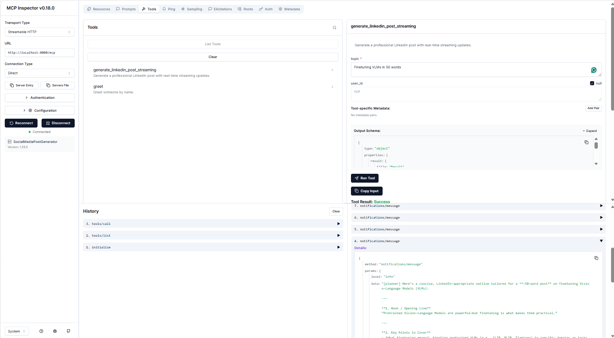

# MCP Client & Streamlit UI

Clients for the Multi-Agent LinkedIn Post Generator.

## Available Clients

### 1. Streamlit Chat Interface (`streamlit_app.py`)

A modern chat-based UI for generating content with real-time progress updates.

#### Features

✅ **Chat Interface** - Conversational UI for content generation  
✅ **Real-time Progress** - Visual progress bar showing workflow stages  
✅ **Agent Status** - See which agent is currently working  
✅ **Chat History** - Maintains conversation history in session  
✅ **Health Monitoring** - Shows orchestrator connection status  

#### Quick Start

```bash
# Install dependencies
pip install -r clients/requirements.txt

# Ensure orchestrator is running
docker-compose up -d

# Run Streamlit app
streamlit run clients/streamlit_app.py
```

The app will open at `http://localhost:8501`

#### Screenshot

```
┌─────────────────────────────────────────────────────────┐
│  🤖 Multi-Agent Content Generator                       │
├─────────────────────────────────────────────────────────┤
│                                                         │
│  👤 User: Generate a post about AI in healthcare        │
│                                                         │
│  🎯 Planning... ████████░░░░░░░░░░░░ 40%               │
│                                                         │
│  🤖 Assistant:                                          │
│  🚀 Healthcare is being transformed by AI...            │
│                                                         │
└─────────────────────────────────────────────────────────┘
```

---

### 2. MCP Console Client (`mcp_client.py`)

Progress: 50% - Drafting post...
🔔 Notification received:
========================================
Notification: [writer] 🌍 A 10‑word insight on the global mango s...

Progress: 90% - Finalizing...
Progress: 100% - Complete!

✅ Final post:

🌍 A 10‑word insight on the global mango supply chain:
...
```

## How It Works

The client uses the official MCP Python SDK with Streamable HTTP transport:

1. **Connection**: Establishes a streaming HTTP connection to the FastMCP server
2. **Tool Discovery**: Lists all available tools and their descriptions
3. **Tool Invocation**: Calls `generate_linkedin_post_streaming` with a topic
4. **Real-time Updates**: 
   - **Progress callbacks** show generation stages (20%, 50%, 90%, 100%)
   - **Notification logs** display intermediate outputs from each agent:
     - `[planner]` - Content outline and structure
     - `[researcher]` - Retrieved documents count
     - `[writer]` - Draft content
     - `[reviewer]` - Quality evaluation (if available)
5. **Final Result**: Displays the complete generated LinkedIn post

## Customization

Edit [`mcp_client.py`](mcp_client.py) to change the topic or tool:

```python
tool_name = "generate_linkedin_post_streaming"
arguments = {"topic": "your topic here"}
```

## Testing with MCP Inspector

The [MCP Inspector](https://github.com/modelcontextprotocol/inspector) is a visual debugging tool for MCP servers. It provides a web-based UI to test tools, view notifications, and inspect server behavior.

### Install and Run MCP Inspector

1. Ensure your FastMCP server is running:
   ```bash
   python api/main.py
   ```

2. Run MCP Inspector with your server URL:
   ```bash
   npx @modelcontextprotocol/inspector http://localhost:8000/mcp
   ```

3. Open the Inspector UI in your browser (typically opens automatically at `http://localhost:5173`)

### Using MCP Inspector

- **Tools Tab**: Browse and test all available tools
- **Run Tool**: Enter parameters and execute tools
- **View Results**: See tool output including notifications/messages
- **Notifications**: Monitor real-time progress updates and logs
- **History**: Review previous tool calls

### Inspector Configuration

The Inspector connects using:
- **Transport Type**: Streamable HTTP
- **URL**: `http://localhost:8000/mcp`
- **Connection**: Direct (no authentication required for local development)

This is useful for:
- Testing tools without writing client code
- Debugging notification and progress callbacks
- Inspecting tool schemas and parameters
- Validating server responses

## Sample Run 




## Architecture

- **Transport**: Streamable HTTP (`mcp.client.streamable_http`)
- **Protocol**: JSON-RPC 2.0 via MCP SDK
- **Session Management**: Automatic via `ClientSession`
- **Callbacks**:
  - `progress_callback`: Handles progress updates (0.0 to 1.0)
  - `logging_callback`: Handles server notifications and logs

## Available Tools

Run the client to see all available tools. Current tools:
- `generate_linkedin_post_streaming` - Generate posts with streaming updates
- `greet` - Simple greeting tool for testing

## Troubleshooting

**Connection refused**:
- Ensure the FastMCP server is running: `python api/main.py`
- Check the server URL in mcp_client.py matches your server (default: `http://localhost:8000/mcp`)

**No progress updates**:
- Progress callbacks only work with streaming-enabled tools
- Check server logs for errors

**Notifications not showing**:
- Ensure the tool uses `ctx.info()` or `ctx.debug()` methods on the server side
```
    tools = await client.list_tools()
    for tool in tools["tools"]:
        print(f"- {tool['name']}")

asyncio.run(example())
```

## Requirements

Install dependencies:
```bash
pip install -r requirements.txt
```

## Environment

The client expects the API server to be running at `http://localhost:8000` by default.

To use a different URL:
```python
client = MCPClient("https://your-api.azurewebsites.net")
```

Or in interactive mode, modify the base URL in the script.

## License

Same as parent project.
